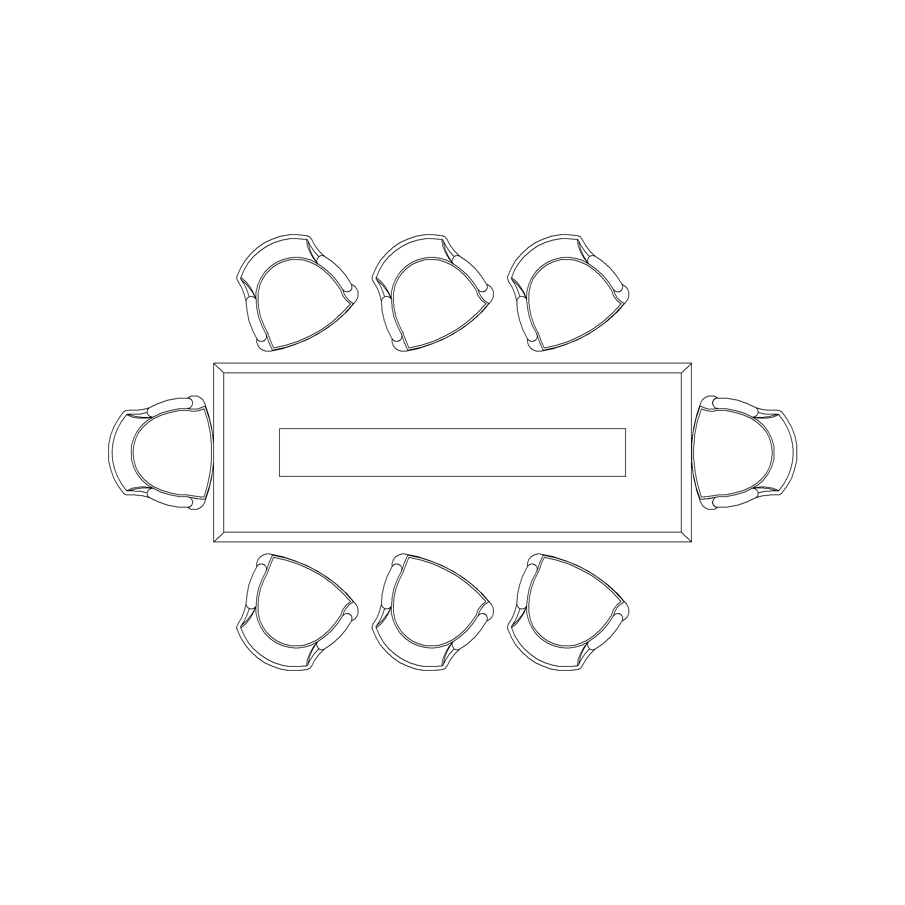

This project consists in using the files `dados.pl` and `keywords.pl`that contain data about events (these files where given to the students by Ana Paiva). With these, we are asked to find:
 - Events with no rooms in general, on a specific day or a specific period (`eventosSemSalas(output)`, `eventosSemSalasDiaSemana(day, output)`, `eventosSemSalasPeriodo(period, output)`),
 - Organize the events, on the period or on the maximum duration (`organizaEventos(events, period, output)`, `eventosMenoresQue(duration, output)`, `eventosMenoresQueBool(event, duration)`),
 - Find the subjects on specific course and organize them by semesters (`procuraDisciplinas(course, output)`, `organizaDisciplinas(subjects, course, output)`),
 - Find the total number of hours of a course in a specific period or not (`horasCurso(period, couse, year, output)`, `evolucaoHorasCurso(couse, output)`),
 - Find the superpositions between two intervals of hours (`ocupaSolt(a1, a2, b1, b2, output)`),
 - The number of hours occupied in a specific period, room, day and interval (`numHorasOcupadas(period, room, day, a, b, output)`),
 - The total time occupied in a room, for a specific interval and the percentage relative to the total number of hours in a period (`ocupacaoMax(room, a, b, output)`, `percentagem(total, max, output)`),
 - The percentage of occupation on a specific room and day (`ocupacaoCritica(a, b, threshold, output)`).

Then, we are asked for something completely different, which is to organize eight people on a table:
 
| |
|:--:|
|  |

(Image Reference: https://cadblockdwg.com/product/conference-table-and-chair-8-seater-2d-top-view-plan/)

However, some rules are given:
- `lado(a, b)`, a and b are sitting side by side,
- `frente(a, b)`, a and b are sitting front to front, 
- `naoLado(a, b)`, a and b are not sitting side by side,
- `naoFrente(a, b)`, a and b are not two people sitting side by side,
- `cab1(a)`, a sits on the left side,
- `cab2(a)`, a sits on the right side,
- `honra(a, b)`, b sits on the right side of a.

Note: This is an academic project. The idea of the project came from Albert Abad (Instituto Superior Técnico, Lisbon, Portugal)